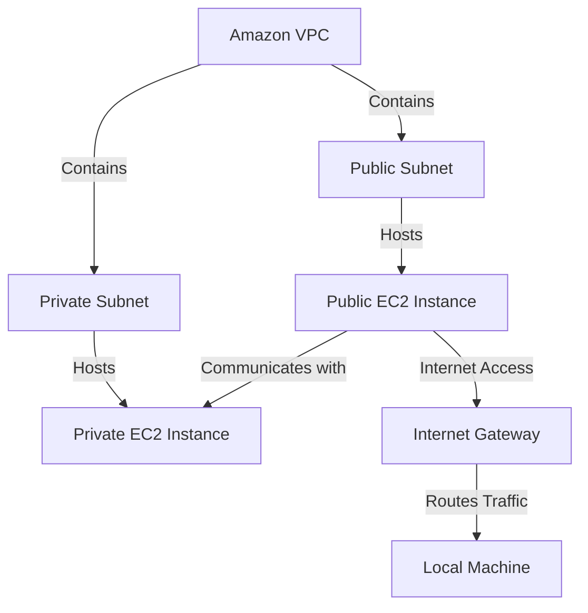
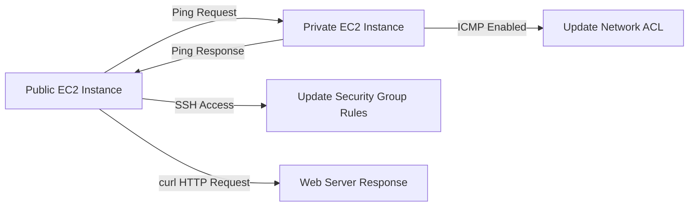

# 🌐 **AWS VPC Connectivity Project** 🌐  

Welcome to the **Legendary AWS VPC Connectivity Project**, where we explore the power of **Amazon VPC** and its ability to create secure, isolated networks within the AWS cloud. This project demonstrates the practical steps of managing EC2 instances, troubleshooting connectivity, and configuring secure communication between resources in a VPC.

---

## 🏗️ **Today's Achievements**  

### 🌟 **1. Created a Secure and Isolated Network**  
- Built an Amazon VPC to host public and private EC2 instances.  
- Configured **subnets**, **route tables**, **Network ACLs**, and **security groups** for network isolation and control.  

### 🔒 **2. Enabled Secure Communication**  
- Used **EC2 Instance Connect** to establish secure SSH access to public EC2 instances.  
- Configured **ICMP rules** to enable communication between public and private EC2 instances.  

### 🌐 **3. Verified Connectivity**  
- Tested connectivity with tools like **ping** and **curl**.  
- Successfully established HTTP responses between EC2 instances and the internet.

---

## 📖 **Understanding the Components**  

### What is **Amazon VPC**?  
Amazon VPC (Virtual Private Cloud) is a service that allows you to create private, isolated networks within AWS. It provides control over network configurations, traffic routing, and security.  

### Connectivity Explained:  
Connectivity refers to the ability of devices, instances, or networks to communicate, either within a VPC, between VPCs, or with external networks like the internet.

---

## 🗺️ **Project Workflow**  

### High-Level Flow  


## 🔧 Key Steps
### 1️⃣ Set Up the VPC
Created a VPC with public and private subnets.
Configured an Internet Gateway for external connectivity.
Set up route tables to manage traffic between subnets and the internet.
### 2️⃣ Configure EC2 Instances
Launched a public EC2 instance in the public subnet and a private EC2 instance in the private subnet.
Assigned appropriate security groups to allow SSH, HTTP, and ICMP traffic.
### 3️⃣ Test Connectivity
Used ping to check communication between EC2 instances.
Used curl to verify web server responses over HTTP.
## 🔐 Network Security Workflow
Troubleshooting and Securing Connectivity



## 🎨 Ping vs Curl

| **Tool** | **Purpose**                                           | **Example Command**     |
|----------|-------------------------------------------------------|--------------------------|
| **Ping** | Tests basic network connectivity using ICMP packets.  | `ping 10.0.1.231`       |
| **Curl** | Sends HTTP requests to check server responses.         | `curl http://10.0.1.231` |

## 🌟 Achievements and Learnings
### 🏆 Achievements
Successfully connected to EC2 instances using Instance Connect.
Verified connectivity across subnets and to the internet.
Secured the VPC using ACLs and security groups.
### 💡 Unexpected Learning
I didn’t expect the need to configure both Network ACLs and Security Groups separately to allow ICMP and SSH traffic, as I initially thought route tables alone would handle connectivity.

## 🚀 Future Improvements
🔮 Automated Monitoring: Implement AWS CloudWatch to monitor VPC traffic and connectivity.
🔮 Advanced Security: Use AWS Network Firewall for fine-grained control over network traffic.
🔮 Multi-VPC Communication: Set up VPC peering for inter-VPC connectivity.

## 📧 Contact Me
For questions or feedback, reach out:
📨 Email: briannkimemia@gmail.com
🌐 Portfolio: [Brian Kimemia](https://briankimemia.vercel.app/projects)

Thank you for exploring this project! Let's build and innovate together. 🚀

```markdown
---

### Key Features:
1. **Mermaid Diagrams**: Represent complex workflows visually.
2. **Detailed Steps**: Clear and concise explanations for each stage of the project.
3. **Tool Comparisons**: Highlights the differences between `ping` and `curl`.
4. **Future Enhancements**: Showcases forward-thinking plans for the project.

Copy and paste this into your `README.md` for a creative, interactive, and highly visual documentation! Let me know if you'd like further refinements. 🚀


